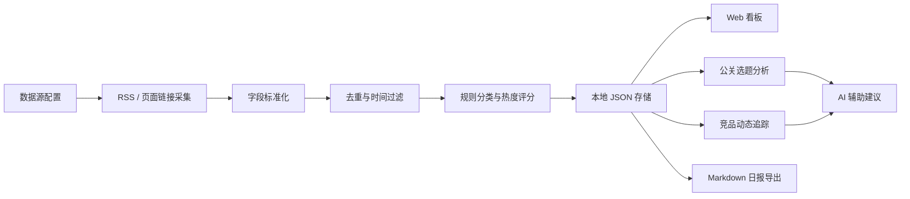

# Finance Radar 项目开发经验与方法汇报

## 0. 分享定位

**分享主题**：从“财经新闻抓取工具”到“科技公司公关选题雷达”的快速构建方法。

**适用场景**：项目复盘、团队技术分享、业务工具建设经验交流、AI 辅助开发方法沉淀。

**建议时长**：20-30 分钟。

**一句话总结**：这个项目的核心经验不是“写了一个爬虫”，而是把新闻源治理、领域筛选规则、AI 辅助分析、Web 看板和报告输出串成了一条可迭代的业务工作流。

---

## 1. 项目背景与目标

### 1.1 背景问题

财经科技信息分散在法披媒体、快讯平台、综合财经媒体、科技产业媒体、官方数据源和市场指标中。人工每天筛选会遇到几个典型问题：

- 信息源多，重复度高，容易漏掉关键线索。
- 泛科技、生活方式、娱乐体育等噪音混入严重。
- 新闻本身不是最终产物，公关团队真正需要的是选题机会、口径准备、竞品动态和可输出报告。
- AI 可以辅助判断，但如果全量依赖 AI 抓取和解析，成本高、速度慢、结果不稳定。

### 1.2 项目目标

项目定位为本地运行的财经科技日报和公关选题看板，重点覆盖：

- AI 应用 / AI Agent
- AI 硬件 / 算力基础设施
- 半导体 / PCB
- 具身智能与机器人
- IPO / A股科技
- 港股科技
- 全球市场与宏观变量

核心目标包括：

- 在每天固定时间窗口内抓取近 24 小时重要信息。
- 统一 RSS、无 RSS 页面、官方数据和市场快讯的采集格式。
- 通过规则和权重过滤低价值内容。
- 生成结构化看板、文章明细、公关分析、竞品追踪和 Markdown 日报。
- 尽量本地化、低依赖、低成本，便于迁移到公司电脑运行。

---

## 2. 总体架构



### 2.1 模块分工

| 模块 | 作用 | 代表文件 |
| --- | --- | --- |
| 配置层 | 数据源、关键词、AI 模型、竞品清单 | `config/settings.py`, `config/competitors.py` |
| 采集层 | RSS 抓取、无 RSS 页面链接提取、时间解析 | `crawlers/link_collectors.py`, `crawlers/rssless_sources.py` |
| 处理层 | 去重、分类、聚合、AI 提取、公关分析 | `processors/` |
| 存储层 | 本地 JSON 兼容数据库接口 | `database/operations.py` |
| 服务层 | Flask API、配置接口、抓取接口、导出接口 | `web/app.py` |
| 展示层 | Web 看板、标签页、明细与报告预览 | `web/templates/` |
| 输出层 | 日报生成与 Markdown 导出 | `output/daily_report.py` |
| 测试层 | 抓取器、链接解析、烟测 | `tests/` |

### 2.2 数据流特点

项目不是“一步到位生成报告”，而是拆成可观察的流水线：

1. 先抓链接和摘要，保留原文链接。
2. 再做字段归一，统一为 `title/source/publish_time/url/content/category/tags/heat_score`。
3. 然后去重、分类、打分、存储。
4. 最后按不同业务视图输出：看板、明细、公关建议、竞品报告、日报。

这种拆法的好处是每一步都能检查、回滚和替换，不会把所有复杂性压进一个大函数。

---

## 3. 核心开发方法

### 3.1 先定义业务筛选标准，再写代码

项目中最重要的沉淀之一是《新闻筛选标准》。它先回答“什么新闻值得进入日报”，再指导实现：

- 六大赛道是白名单方向。
- 体育、娱乐、生活方式、低信息量标题是默认噪音。
- 官方、交易所、监管、上市公司公告等来源给高权重。
- 通过 `relevance_score` 思路把赛道相关性、事件确定性、来源权威性、市场影响、新鲜度和可验证性拆开。

经验：对信息类工具来说，规则文档就是产品需求，也是测试标准。先把判断标准写清楚，代码才不会变成一堆临时关键词。

### 3.2 规则优先，AI 补位

项目没有把 AI 当成万能解析器，而是采用“规则优先，AI 补位”的策略：

- 无 RSS 媒体优先用链接模式匹配和关键词过滤。
- 页面结构稳定时，用正则和 HTMLParser 提取链接。
- 时间、来源、标题、URL 先用确定性逻辑处理。
- AI 主要用于抓取计划、公关选题、竞品分析等高价值判断场景。

这样做带来三个收益：

- 成本低：常规抓取不消耗 token。
- 速度快：规则解析比 AI 全文解析更稳定。
- 可控性强：AI 输出失败时仍有 fallback 逻辑。

### 3.3 配置驱动扩展数据源

无 RSS 媒体被抽象为 `RsslessSourceSpec`：

```python
RsslessSourceSpec(
    source_id="latepost",
    source_name="晚点 LatePost",
    source_type="科技产业",
    homepage="https://www.latepost.com/",
    list_urls=[...],
    article_pattern=re.compile(...),
    default_limit=8,
    max_age_hours=72,
)
```

新增媒体时不需要重写主流程，只需要补充：

- 媒体 ID 和名称。
- 列表页 URL。
- 文章链接正则。
- 抓取数量和时效窗口。
- 是否要求单条新闻有明确发布时间。

经验：把变化点做成配置，把稳定流程固化为框架，是小项目能持续扩展的关键。

### 3.4 本地优先，降低部署门槛

项目保留了 MongoDB、Redis 等配置，但当前核心存储采用本地 JSON：

- 不依赖外部数据库即可运行。
- 便于迁移到公司电脑。
- Flask 服务和本地文件即可完成看板、查询、报告生成。
- 通过 `DatabaseManager` 保持类似数据库的方法名，未来迁回真实数据库也比较容易。

经验：早期工具优先保证“能稳定被业务同事打开使用”，不要过早引入复杂部署。

### 3.5 让 AI 输出面向工作场景，而不是泛泛总结

公关分析的 Prompt 明确要求：

- 只基于给定新闻，不虚构事实。
- 站在 AI 硬件公司公关视角。
- 输出选题机会、表达角度、证明材料、下一步行动、采访问题、社媒话题和风险点。
- 区分媒体价值、时效性和传播渠道。

这让 AI 的产物直接服务选题会、媒体沟通和社媒运营，而不是停留在“摘要一下新闻”。

经验：AI 功能要从使用场景倒推结构化输出字段，字段设计比模型调用本身更重要。

### 3.6 用降级策略保证可用性

多个模块都有 fallback：

- RSS 不可用时尝试列表页。
- TLS 证书异常时尝试非验证上下文。
- AI 未配置时返回规则生成的基础建议。
- 本地 JSON 读取失败时返回空集合。
- 无新闻时看板和报告给出明确空状态。

经验：内部工具不怕功能简单，怕关键时刻完全不可用。降级逻辑能显著提高可信度。

---

## 4. 关键实践案例

### 4.1 无 RSS 媒体抓取

面对财联社、第一财经、界面、晚点、华尔街见闻、财新、21 财经、钛媒体等无 RSS 或 RSS 不稳定媒体，采用公开页面链接采集：

- 先定义文章 URL 模式。
- 从列表页提取 `<a>` 链接和标题。
- 在链接附近查找发布时间。
- 用正面关键词保留财经科技内容。
- 用负面关键词剔除体育、娱乐、生活方式等噪音。
- 对 URL 做去重和 tracking 参数清理。

这套方法的优势是零 token、速度快、可测试、便于增加新媒体。

### 4.2 新闻筛选与评分

新闻不是抓得越多越好，关键是筛得准。项目采用三层过滤：

- 采集前：按来源设定抓取上限、栏目、时效。
- 入库前：剔除明显低相关内容和重复内容。
- 日报前：根据赛道、事件、来源、市场影响、时效、可验证性排序。

最终目标是让日报保留“对财经科技判断有增量的信息”，而不是把互联网新闻列表搬进工具里。

### 4.3 竞品动态追踪

项目把竞品分成 AI 芯片、AI 服务器、云服务、推理芯片等类别，并维护别名映射：

- 从新闻标题和正文中匹配竞品别名。
- 按产品发布、财报业绩、融资并购、战略合作、市场动态等事件分类。
- 生成公关影响判断：需主动回应、可借势传播、需备口径、仅观察。
- 输出口径要点和需要准备的素材。

这部分体现了项目从“新闻工具”升级为“公关工作台”的关键转变。

### 4.4 标签页式 Web 看板

界面规划从单页面扩展为多个工作视图：

- 数据看板：看整体采集、来源、热点和趋势。
- 文章明细：检索、筛选、核验原文。
- 公关分析：输出选题会提案。
- 竞品追踪：查看竞品事件和响应建议。
- 日报预览：生成和导出 Markdown 报告。

经验：业务工具的 UI 不一定追求复杂视觉，但必须贴合工作流。标签页让用户知道“现在我在哪一步，要做什么”。

---

## 5. 开发过程中的问题与解决

### 5.1 媒体源不稳定

问题：RSS 可能失效，页面结构可能调整，部分网站返回 HTML 而不是 XML。

解决：

- RSS 与列表页双通道。
- 抓取错误记录具体来源和原因。
- 对 XML 解析、编码、TLS 异常分别处理。
- 把媒体源抽象成配置，单个源坏了不影响整体框架。

### 5.2 噪音新闻太多

问题：科技媒体中夹杂大量生活方式、观点散文、娱乐体育和泛话题文章。

解决：

- 明确正负关键词。
- 对聚合早报、低信息量标题、泛观点文章降权。
- 官方数据、监管、公告类强制保留。
- 重要事件多源重复时保留权威来源或信息增量最大的版本。

### 5.3 AI 输出不可控

问题：AI 可能扩写、虚构、格式不稳定。

解决：

- 强制 JSON 输出。
- Prompt 中要求只基于给定新闻。
- 设置低 temperature。
- 对返回结果做字段标准化。
- 提供非 AI fallback。

### 5.4 部署环境不确定

问题：公司电脑环境可能没有数据库、没有完整 Python 依赖、网络证书也可能不同。

解决：

- 本地 JSON 存储。
- 提供 `run_web.bat` / `run_web.ps1` 启动脚本。
- 保留标准库备用服务思路。
- 配置和密钥放在 `.env`，不写死进代码。

---

## 6. 可复用的方法论

### 6.1 做信息工具的五步法

1. **先定业务口径**：什么算有用，什么必须排除，什么只做线索。
2. **再定数据结构**：所有来源最后统一成同一种文章对象。
3. **规则处理常规情况**：抓取、去重、时间解析、初筛尽量确定性。
4. **AI 处理高价值判断**：选题建议、竞品洞察、口径准备交给 AI。
5. **输出贴近工作流**：看板、明细、报告、行动项都要服务真实使用场景。

### 6.2 小工具工程化原则

- 配置优先于硬编码。
- 每个模块只做一类事情。
- 保留原文链接和来源，方便核验。
- 有失败提示，也要有降级结果。
- 先做本地可跑，再考虑复杂部署。
- 对最容易坏的部分写测试，例如链接提取、时间过滤、去重。

### 6.3 AI 辅助开发经验

- 让 AI 先帮忙梳理需求文档和筛选规则，再进入代码实现。
- 对不稳定、成本高的环节，不要直接让 AI 接管主链路。
- AI 更适合生成结构化建议、分析框架、Prompt 和测试用例。
- 所有 AI 结果都应该保留事实输入和原文链接，便于人审。

---

## 7. 当前成果

从代码和文档看，项目已经形成以下能力：

- 支持多类财经科技数据源采集。
- 支持 RSS 与无 RSS 页面链接采集。
- 支持本地 JSON 存储和 Web API 查询。
- 支持新闻分类、热度评分、主题聚合。
- 支持数据看板、文章明细、日报预览。
- 支持公关选题分析和竞品动态追踪。
- 支持 GPT / Claude 分析配置的扩展空间。
- 已有无 RSS 抓取测试和基础烟测。

---

## 8. 后续优化方向

### 8.1 数据质量

- 增加数据源健康监控：最近成功时间、失败原因、抓取数量波动。
- 增加同一事件聚合，把多源报道合并为事件卡片。
- 增加人工标注入口，把“误杀/误收”反馈回规则。

### 8.2 分析能力

- 将新闻筛选标准中的 `relevance_score` 真正落到代码字段。
- 加入多源验证等级：single_source / multi_source / official_confirmed。
- 为公关分析增加模板：产品发布、融资公告、行业趋势、竞品回应。

### 8.3 产品体验

- 在看板中增加数据源健康条和采集日志。
- 支持报告按日期范围、赛道、来源自定义生成。
- 支持竞品追踪配置持久化。
- 支持周报/月报和趋势图。

### 8.4 工程质量

- 扩展测试覆盖：去重、分类、报告生成、API 响应。
- 增加抓取失败样本库，防止媒体改版后静默失败。
- 将本地 JSON 存储抽象为可替换后端，未来接入 SQLite 或 MongoDB。

---

## 9. 分享页纲

### 第 1 页：标题

Finance Radar 项目开发经验与方法  
副标题：从财经新闻抓取到公关选题雷达

### 第 2 页：为什么要做

- 信息源分散
- 噪音和重复多
- 人工筛选成本高
- 公关团队需要行动建议，不只是新闻摘要

### 第 3 页：项目目标

- 抓取近 24 小时财经科技信息
- 聚焦 AI 硬件、半导体、机器人、IPO、港股科技、宏观变量
- 输出看板、明细、公关建议、竞品追踪和日报

### 第 4 页：总体架构

展示数据流：来源配置 -> 抓取 -> 去重 -> 分类评分 -> 本地存储 -> 看板/分析/报告。

### 第 5 页：方法一，规则先行

- 先写新闻筛选标准
- 明确保留、剔除、候选、降权
- 用业务口径约束代码实现

### 第 6 页：方法二，规则优先，AI 补位

- 抓取和初筛尽量不用 AI
- AI 用在公关分析和竞品洞察
- 既控制成本，也提高稳定性

### 第 7 页：方法三，配置驱动数据源

- RSS 源和无 RSS 源统一输出格式
- 新增媒体主要补配置
- 采集器主流程保持稳定

### 第 8 页：关键案例，无 RSS 媒体抓取

- 链接模式匹配
- 关键词过滤
- 时间解析
- 去重和时效控制

### 第 9 页：关键案例，公关选题分析

- 不是新闻摘要，而是选题会提案
- 输出选题、角度、素材、行动项、采访问题、社媒话题和风险

### 第 10 页：关键案例，竞品追踪

- 竞品别名识别
- 事件分类
- 公关影响判断
- 响应建议和口径准备

### 第 11 页：踩坑与解决

- RSS 不稳定：双通道采集
- 噪音太多：正负规则和评分
- AI 不稳定：结构化输出和 fallback
- 部署复杂：本地 JSON 和启动脚本

### 第 12 页：可复用经验

- 业务标准先行
- 数据结构统一
- 规则处理确定性任务
- AI 处理高价值判断
- 输出贴合真实工作流

### 第 13 页：后续规划

- 数据源健康监控
- 事件级聚合
- 人工反馈闭环
- 报告自定义
- 周报/月报趋势分析

### 第 14 页：总结

Finance Radar 的价值在于把信息采集、筛选、分析和输出做成一条闭环。它证明了一个实用型 AI 工具的开发路径：不是先追求模型能力最大化，而是先把业务判断、数据结构、工作流和降级机制设计清楚。

---

## 10. 结尾金句

这个项目给我的最大启发是：  

**AI 工具真正有用的地方，不是替人“看更多信息”，而是帮人把信息变成可以判断、可以讨论、可以行动的工作材料。**
